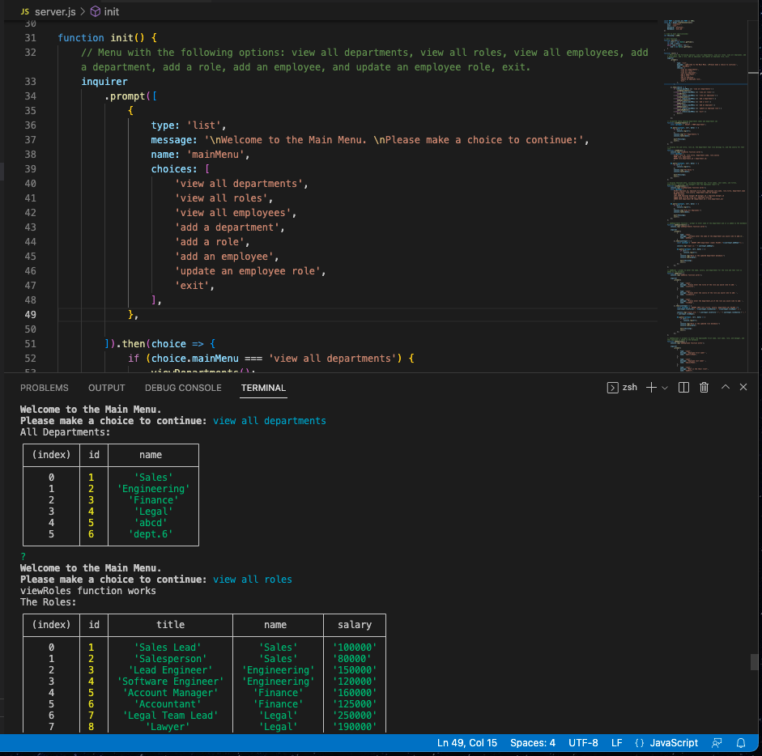

# CmdLine_OrgChart_12.1

## Title: The Command Line OrgChart App
 

## Description:
This is a command-line application to manage an employee database. It uses Node.js, Inquirer, and MySQL.
  

## Usage (type in terminal):
npm i
 
node server.js
   

## Links:  
repo: https://github.com/xnd0/CmdLine_OrgChart_12.1
 
walkthrough video: https://www.loom.com/share/248139dbbfbf49d1ab8411d8af6a6cf6
  

## Screenshots:

 

## Technologies Used:
Javascript, Node.js, Inquirer, and MySQL